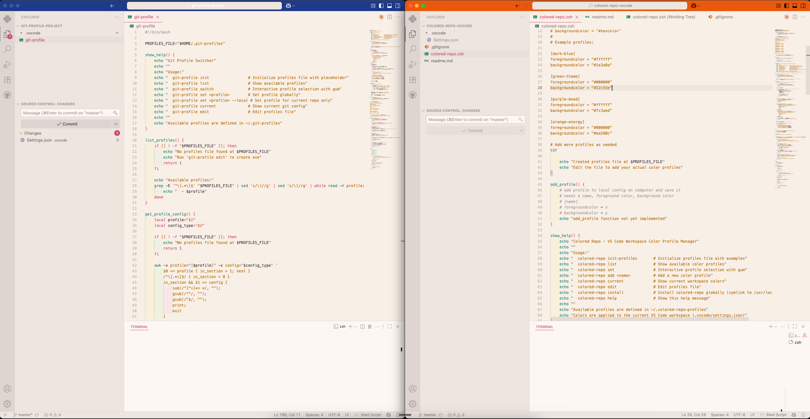

# Colored Repo - VS Code Title Bar Colorizer

A simple zsh tool that lets you customize the title bar color of VS Code workspaces. This is particularly useful when working across different repositories or worktrees, as it provides instant visual identification of which project you're currently in.

## Why Use This?

I created this tool to solve a common problem: when working with multiple VS Code windows open for different projects, it's easy to lose track of which window corresponds to which repository. This is especially helpful when:

- Switching between a main project and its dependencies or libraries
- Ensuring you're returning to the correct Claude Code or Gemini session in the right project
- Working with multiple worktrees or branches simultaneously
- Needing quick visual confirmation of your current workspace context

The colored title bar provides an immediate visual cue, eliminating the need to check file paths or project names to confirm which repository you're working in.